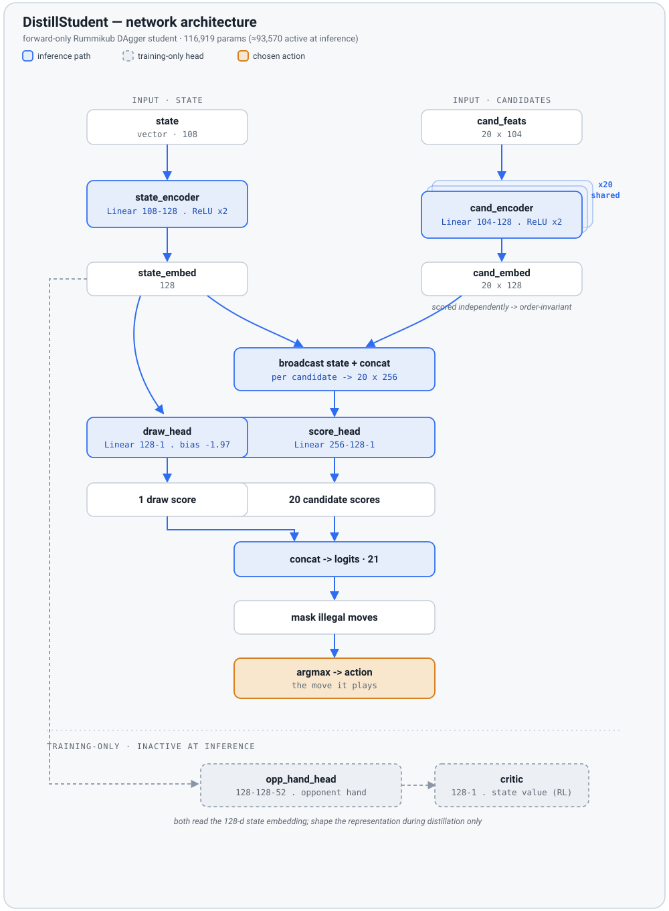

# AID Rummikub

**English** · [한국어](README.ko.md)

**Beating an optimal one-turn baseline in two-player Rummikub with a distilled, forward-only policy network.**

A learned agent that plays hidden-information two-player Rummikub (no jokers; 4 colors × 13 numbers × 2 decks = 104 tiles) and **significantly beats the greedy ILP baseline** — using no search at inference. The winning policy is a ~94K-parameter network distilled from a search-based teacher via **DAgger**.

> **Headline result:** a forward-only network wins **67.8%** vs. the greedy baseline over 1,000 mirror-paired games (≈17σ over 50%), generalizes to a random opponent (69.6%), and — by ablation — the edge comes from the **network's move selection**, not the solver's candidate generation.

---

## TL;DR

- **The problem.** Search (Monte-Carlo rollouts + endgame lookahead) plays this game well but is far too slow for real-time use. Naively imitating a search teacher (off-policy behavior cloning) **collapses** under covariate shift.
- **The fix.** **DAgger** — the student plays, visiting its own state distribution, and the teacher relabels the correct move at each state it actually reaches. This breaks the compounding-error loop that sinks off-policy distillation.
- **The outcome.** A tiny forward-only network reaches — and empirically exceeds — teacher-level play, satisfying the project's goal of a *pure-network* agent.

| Agent                                       |        Win rate | pair net | Notes                                         |
| ------------------------------------------- | --------------: | -------: | --------------------------------------------- |
| greedy vs greedy (sanity)                   |            ~48% |       — | harness neutral baseline                      |
| greedy-copier ceiling                       |           52.5% |       — | best a greedy-imitating student reaches       |
| search-based teacher                        |           56.9% |    +0.46 | information-consistent rollout + endgame DFS  |
| **off-policy distillation (control)** | **28.7%** |   −9.12 | same recipe, no DAgger → collapse            |
| **DAgger student (160 pairs)**        | **70.3%** |    +0.99 | ~7σ over the copier ceiling                  |
| **DAgger student (1,000 pairs)**      | **67.8%** |    +0.29 | large-N confirmation, ~17σ over 50%          |
| full oracle (cheats: hand + deck)           |            ~89% |       — | theoretical reference; dominated by deck luck |

All comparisons use **mirror-paired** evaluation (same deck, seats swapped) to cancel deal luck; standard rule (initial meld ≥ 30); train/eval seeds disjoint.

---

## Why it works

The winning edge is *isolated* by an ablation that holds the solver's candidate set fixed and varies only the **selection function**:

| Selection over identical candidates |        Win rate |
| ----------------------------------- | --------------: |
| uniform random                      |           40.6% |
| greedy max-tiles heuristic          |           46.2% |
| **learned network**           | **70.3%** |

Random selection is *worse* than greedy, so the candidate set alone confers no advantage — the +24–30 point gap is entirely the network's learned choice. Instrumentation confirms the network is genuinely active (it overrides the greedy max-play on **34%** of decisions, including **19.5%** where it strategically *holds* tiles the greedy heuristic would always play), and its deviations are **teacher-aligned** (when the teacher departs from greedy, the student departs too 77% of the time; exact-move agreement 49%).

---

## How it works (pipeline)

```
                     ┌── information-consistent PIMC rollout (det=8)
1. Teacher  ─────────┤
   (slow, strong)    └── endgame win-forcing DFS  (+ greedy-margin guard)

2. DAgger data   student plays → visits its own states → teacher relabels the
                 correct move (+ per-candidate rollout scores) at each state

3. Distillation  soft cross-entropy (teacher rollout margins) + value regression
                 → forward-only DistillStudent network (no search at inference)
```

The teacher does not use an oracle: it estimates each candidate's value by simulating plausible (information-consistent) continuations, and proves forced wins by search in the endgame. The student distills those *decisions* into a fast reactive policy and, by averaging out the noisy 1-ply teacher's per-move variance, exceeds it — an expert-iteration (ExIt) effect.

### The network (`DistillStudent` — 116,919 params; ≈93.5K used at inference)



A permutation-invariant scoring network: a shared candidate encoder scores each legal move from *(state, that candidate)* alone, so the output never depends on candidate order — the network must read each move's features rather than memorize a slot.

| Module            | Shape                       | Params | At inference |
| ----------------- | --------------------------- | -----: | ------------ |
| `state_encoder` | 108→128→128               | 30,464 | ✅           |
| `cand_encoder`  | 104→128→128 (shared ×20) | 29,952 | ✅           |
| `score_head`    | 256→128→1                 | 33,025 | ✅           |
| `draw_head`     | 128→1 (bias −1.97)        |    129 | ✅           |
| `opp_hand_head` | 128→128→52                | 23,220 | train-only   |
| `critic`        | 128→1                      |    129 | train-only   |

---

## Repository layout

| File                              | Role                                                                                   |
| --------------------------------- | -------------------------------------------------------------------------------------- |
| `rummikub_solver.py`            | one-turn optimization ILP (`solve`), candidate diversification (`solve_many`)      |
| `rummikub_dp.py`                | van Rijn & Takes-style DP solver for the hot path (≈26× over ILP)                    |
| `rummikub_env.py`               | game state (deck / hands / table) + solver wrapper                                     |
| `ppo_env.py`                    | Gymnasium environment: observation, reward, opponent (greedy / random)                 |
| `ppo_model.py`                  | `ActorCritic` + `DistillStudent` (state encoder + candidate encoder + score head)  |
| `rollout_agent.py`              | determinized-rollout teacher + endgame win-forcing DFS                                 |
| `selfplay_data.py`              | self-play / DAgger data generation (`--actor student` relabels student trajectories) |
| `distill.py`                    | supervised distillation (soft CE + value regression + optional aux head)               |
| `eval_mirror.py`                | low-variance mirror-pair evaluation (`--policy student/greedy/rollout/random`)       |
| `autopsy_oracle.py`             | loss-game autopsy — DFS over own move branches to prove winnability                   |
| `train_ppo.py`, `eval_ppo.py` | PPO training / evaluation (R1–R7 era)                                                 |

The R10 strategy is in `ROADMAP.md`; the paper plan in `docs/paper_chapter_plan.md`; the full game rules and observation/action encoding in `docs/game_rules.md`; a standalone reproduction of the HiGHS presolve bug in `docs/highs_presolve_bug/`.

---

## Quickstart

```bash
# environment (conda-forge; the pulp solver uses in-process HiGHS, presolve off)
conda create -n rummikub python=3.11
conda activate rummikub
conda install -c conda-forge numpy pytorch pulp highspy gymnasium
```

The winning model `distill_s1s_dagger1.pt` is included in the repo, so you can jump to step 3 and evaluate directly. Other checkpoints and datasets (`data/`) are not tracked — regenerate them with the pipeline:

```bash
# 1) generate DAgger data (student plays, teacher relabels)
python selfplay_data.py --teacher rollout --consistent --greedy-margin 1.0 --endgame-search \
    --determinizations 8 --rollout-turns 24 --candidate-cap 4 \
    --actor student --actor-model <prior_student>.pt \
    --pairs 500 --seed 220000 --initial-meld-value 30 --out data/dagger1 --workers 8

# 2) distill the student
python distill.py --data data/s1s_dagger1 --tag s1s_dagger1 \
    --epochs 10 --soft-temp 0.3 --value-coef 0.5

# 3) evaluate (mirror-paired) — the headline number
python eval_mirror.py --policy student --model distill_s1s_dagger1.pt \
    --pairs 160 --seed 2000 --initial-meld-value 30 --workers 8

# ablation: identical candidates, different selection functions
python eval_mirror.py --policy random --pairs 160 --seed 2000 --initial-meld-value 30 --workers 8
python eval_mirror.py --policy greedy --pairs 160 --seed 2000 --initial-meld-value 30 --workers 8
```

---

## Limitations

- **Solver-dependent candidates.** Legal-move enumeration is done by the solver (a rules engine); the network makes every *selection*. A fully end-to-end network that also generates moves is future work.
- **Teacher-bounded discovery.** Distillation cannot invent strategies the teacher never demonstrates (an ExIt limitation).
- **Single game / rule / teacher.** Results are for two-player Rummikub at meld ≥ 30 with one teacher configuration; cross-game transfer is a conjecture, not a demonstrated result.
- **Luck-heavy game.** Deal variance is large (greedy beats a random opponent only ~52%); absolute win-rate ceilings are game-specific, which is why all comparisons use mirror-paired evaluation.

---

## References

- Ross, Gordon & Bagnell (2011). *A Reduction of Imitation Learning and Structured Prediction to No-Regret Online Learning* (DAgger).
- Anthony, Tian & Barber (2017). *Thinking Fast and Slow with Deep Learning and Tree Search* (Expert Iteration).
- Long, Sturtevant, Buro & Furtak (2010). *Understanding the Success of Perfect Information Monte Carlo Sampling in Game Tree Search*.
- van Rijn & Takes (2016). *The Complexity of Rummikub Problems* ([arXiv:1604.07553](https://arxiv.org/abs/1604.07553)).
